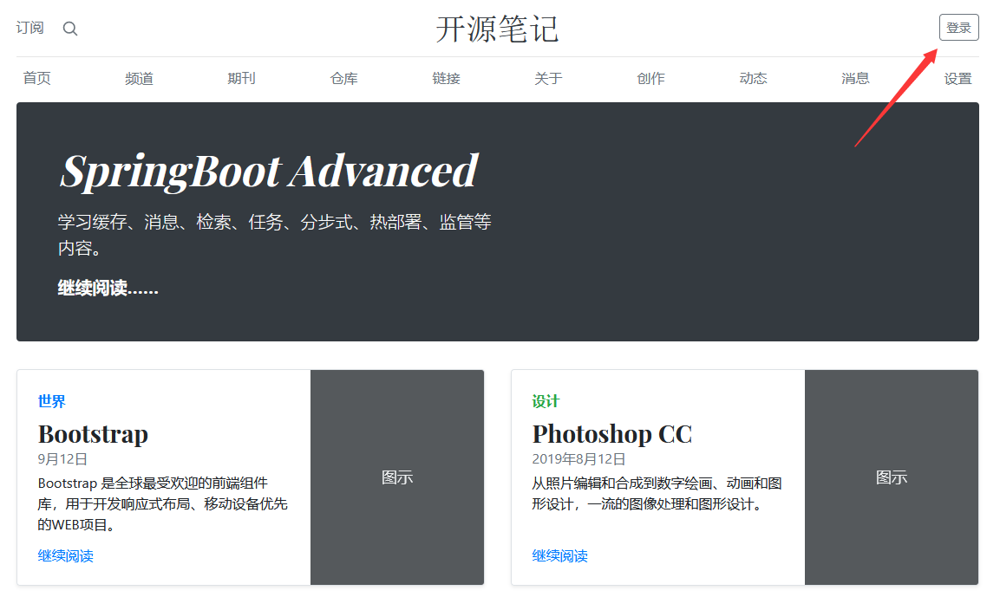
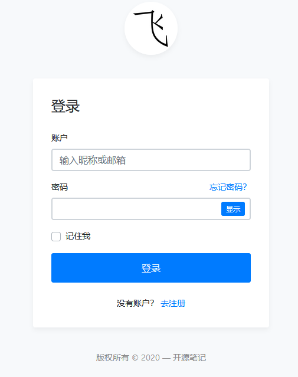
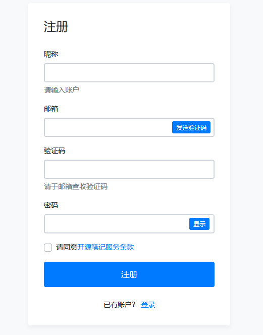
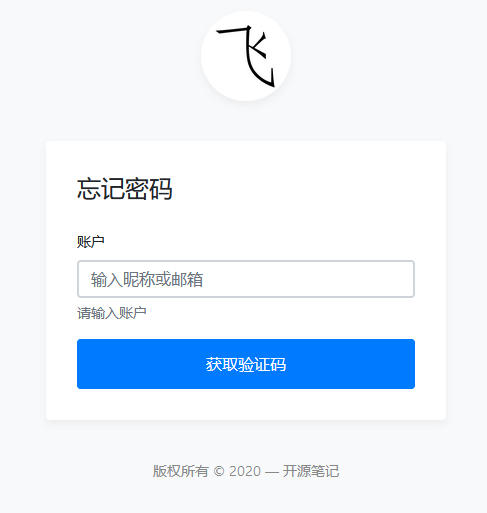
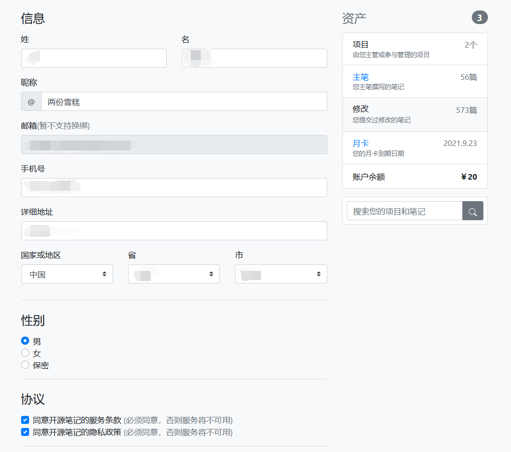
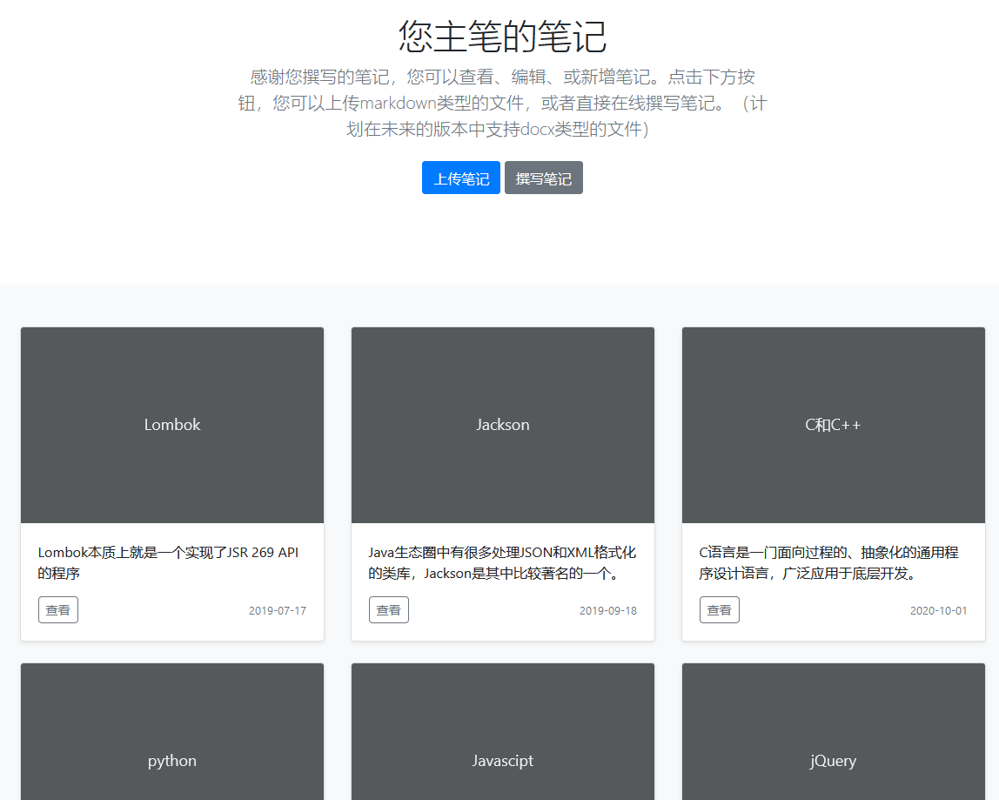
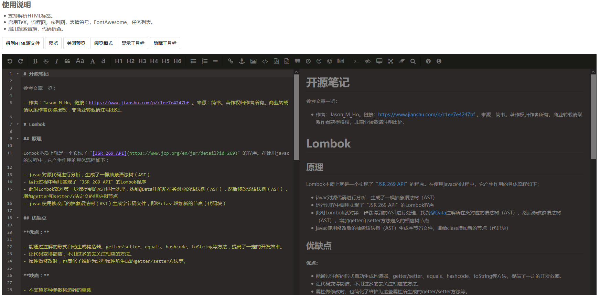
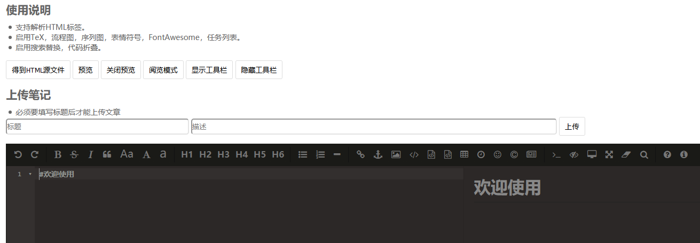

# 项目介绍

个人用于练手的项目。能实现登录、注册、修改个人信息等用户管理功能，发布、查看、收藏、修改笔记等的内容服务功能。（收藏和修改功能还在开发中）

## 技术栈

使用前后端分离的开发方式。使用到的后端技术栈有Spring Boot、Spring Cache、Spring Security、MyBaits、MySQL、Elasticsearch、Redis等，前端技术栈有Vue、JQuery、Bootstrap、Font Awesome，项目管理工具有Git、Maven。目前项目运行于Ubuntu 20.04环境，并使用了Docker。使用的JDK版本为11。

## 使用说明

点击登录：

登录界面：

支持通过邮箱注册：

可以通过邮箱更换密码：

登录后点击“用户名”可以查看个人信息：

点击主笔可以查看自己撰写的笔记：

可以查看具体某篇笔记，或者点击撰写笔记来写新笔记：

查看效果：

撰写效果：

# 开发规范

## 代码风格

### Java

变量：驼峰命名法，首字母小写。
常量：全大写，使用下划线分隔单词。

### MySQL

全小写，使用下划线分隔单词。